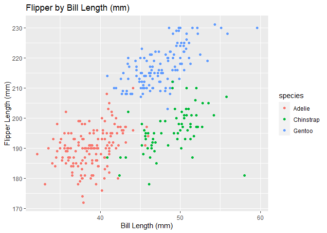

p8510\_hw1\_ly2496
================
Ling Yi
9/15/2020

This is my solution to hw1

``` r
library(tidyverse)
```

    ## -- Attaching packages ------------ tidyverse 1.3.0 --

    ## v ggplot2 3.3.2     v purrr   0.3.4
    ## v tibble  3.0.1     v dplyr   1.0.1
    ## v tidyr   1.1.0     v stringr 1.4.0
    ## v readr   1.3.1     v forcats 0.5.0

    ## -- Conflicts --------------- tidyverse_conflicts() --
    ## x dplyr::filter() masks stats::filter()
    ## x dplyr::lag()    masks stats::lag()

\#\#Problem 1

Create a data frame for the specified elements

``` r
prob1_df <- 
  tibble (
    samp = rnorm(10),
    samp_gt_0 = samp >0, 
    char_vec = c("a", "b", "c", "d", "e", "f", "G", "h", "I", "j"),
    factor_vec = factor(c("low", "low", "low", "med", "med", "med", "med", "high", "high", "high"))
 
 ) 
```

Take the mean of each variable in the data frame

``` r
mean(pull(prob1_df, samp))
```

    ## [1] -0.7530561

``` r
mean(pull(prob1_df, samp_gt_0))
```

    ## [1] 0.2

``` r
mean(pull(prob1_df, char_vec))
```

    ## Warning in mean.default(pull(prob1_df, char_vec)): argument is not numeric or
    ## logical: returning NA

    ## [1] NA

``` r
mean(pull(prob1_df, factor_vec))
```

    ## Warning in mean.default(pull(prob1_df, factor_vec)): argument is not numeric or
    ## logical: returning NA

    ## [1] NA

I can take the mean of numeric or logical variables, but not character
or factors (which both returned NA) For the logical vector, R is
conducting variable coercion (taking those that are logical and turning
them into the numbers and then taking the mean of it)

``` r
as.numeric(pull(prob1_df, samp))
```

    ##  [1] -1.5148173 -0.4860495 -2.5385231 -2.0897883  1.2225153 -0.7244168
    ##  [7] -2.0402892 -1.1875608 -0.2762935  2.1046628

``` r
as.numeric(pull(prob1_df, samp_gt_0))
```

    ##  [1] 0 0 0 0 1 0 0 0 0 1

``` r
as.numeric(pull(prob1_df, char_vec))
```

    ## Warning: NAs introduced by coercion

    ##  [1] NA NA NA NA NA NA NA NA NA NA

``` r
as.numeric(pull(prob1_df, factor_vec))
```

    ##  [1] 2 2 2 3 3 3 3 1 1 1

R is able to convert numerical, logical, and factor variables into
numbers. For the logical variables, the variables are entries into 1 or
0, therefore, R is able to take the mean. R also converts the factor
variable to 1, 2, or 3 to represent the three levels. However, it was
unable to convert character variables into numeric value. This process
is called variable coercion.

``` r
#a. 
as.numeric(pull(prob1_df, samp_gt_0)) * pull(prob1_df, samp)
```

    ##  [1] 0.000000 0.000000 0.000000 0.000000 1.222515 0.000000 0.000000 0.000000
    ##  [9] 0.000000 2.104663

``` r
#b. 
as.factor (pull(prob1_df, samp_gt_0)) * pull(prob1_df, samp)
```

    ## Warning in Ops.factor(as.factor(pull(prob1_df, samp_gt_0)), pull(prob1_df, : '*'
    ## not meaningful for factors

    ##  [1] NA NA NA NA NA NA NA NA NA NA

``` r
#c. 
as.factor(pull(prob1_df, samp_gt_0))
```

    ##  [1] FALSE FALSE FALSE FALSE TRUE  FALSE FALSE FALSE FALSE TRUE 
    ## Levels: FALSE TRUE

``` r
as.numeric(pull(prob1_df, samp_gt_0))*pull(prob1_df, samp)
```

    ##  [1] 0.000000 0.000000 0.000000 0.000000 1.222515 0.000000 0.000000 0.000000
    ##  [9] 0.000000 2.104663

I was able to take the product when converting the logical variable to a
numeric value and multiplying it by the result. I was also able to take
the product after converting it to a factor and then converting the
results to a numeric before multiplying it by the result. However, I was
unable to take the product when trying to multiply after converting a
logical variable to a factor variable and multiplying to by the result.

\#\#Problem 2

``` r
data("penguins", package = "palmerpenguins")
```

Description of the data set using inline R code.

The Variables in this date set are species, island, bill\_length\_mm,
bill\_depth\_mm, flipper\_length\_mm, body\_mass\_g, sex, year. There
are three difference species of penguins in the data set and the number
of Adelie is 152, and number of Chinstrap is 68 and the number of Gentoo
is 68. There are four different continunous descriptive variable, which
are bill length, bill depth, flipper length, body mass with mean values
of 43.9219298mm, 17.1511696mm, 200.9152047mm, and 4201.754386g
respectively. One interesting observation from this table is that most
of the penguins came from the Biscoe island (168) and from the Dream
island (124) with the least coming from the Torgersen island (52).
Furthermore, the female to male ratio for the penguins is 165 to 168.
There are 2 missing values for bill length, 2 for bill depth, and 2 for
flipper length, but there are 11 missing values for sex. The minimum
body mass is 2700 and the maximum body mass is 6300 in grams. Both
numbers are in the thousands, so it is interesting that they did not use
kg as the unit of analysis. Further descriptive analysis would require
cross-tabulation.

The number of rows in the data set is 344 and the number of columns in
this data set is 8.

The mean of the flipper length is 200.9152047mm.

**creating a scatterplot of the flipper\_length\_mm (y) vs
bill\_length\_mm (x)**

``` r
library(ggplot2)

ggplot(data = penguins, mapping = aes(x = bill_length_mm, y=flipper_length_mm, color=species)) + geom_point() +
labs(x = "Bill Length (mm)", y = "Flipper Length (mm)")+
  ggtitle("Flipper by Bill Length (mm)")
```

    ## Warning: Removed 2 rows containing missing values (geom_point).

<!-- -->
**exporting the plot to project directory**

``` r
ggsave("Scatter_plot_flipper_bill.pdf", height = 4, width = 6)
```

    ## Warning: Removed 2 rows containing missing values (geom_point).
